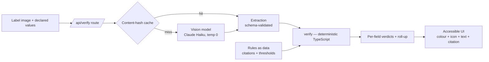

# Architecture

This document explains **how** the system is built and **why** — the design decisions and
their trade-offs. For what it does and how to run it, see [`README.md`](README.md).

---

## Data flow



The request path has exactly one model call (often zero, on a cache hit). Everything after
extraction is deterministic, model-free TypeScript.

---

## Core principle: the model extracts, the code decides

The single most important decision. The vision model is asked **only what is printed on the
label** — never whether it is compliant. All comparison and all regulatory logic live in
TypeScript.

**Why:**

1. **Determinism.** The model returns lean, schema-validated values at `temperature: 0`, so
   identical input yields identical output. A compliance tool that varies run-to-run is not
   fit for purpose, and the measurement harness would be meaningless otherwise.
2. **Auditability.** A wrong verdict traces to *either* an extraction error *or* a
   comparison bug — never a black box. This is what lets an officer trust and override it.
3. **Reviewable rules.** Regulatory logic is code with citations attached, unit-tested at
   its boundaries — not prose buried in a prompt that no one can diff or test.
4. **Latency & cost.** Output tokens dominate latency and generate serially; a lean
   values-only schema keeps the model call fast and cheap.

This reflects what the model actually is: a system optimized for *coherent* output, not
*correct* output. Asked "is this compliant?" it returns something fluent whether or not it's
right. Asked "what text appears here?" it does the task it can actually do.

### Honest nulls

Every extracted field is nullable. An unreadable field returns `null`, never a plausible
guess — because a hallucinated value that happens to match the declared value is a **false
PASS**, the single worst outcome for a compliance tool. `null` converts a hallucination into
an honest FLAG.

---

## Component map

```
src/lib/
  extraction/      image → structured data
    schema.ts        Zod schema — the only thing the model is asked to produce
    prompt.ts        fixed system prompt + § 16.21 text (the cacheable prefix)
    provider.ts      the LLM seam (interface) + factory + shared singleton
    anthropic.ts     real impl — Claude Haiku, vision, temp 0, structured output
    mock.ts          canned impl — runs with no API key
    cache.ts         content-hash result cache (wraps any provider)
  verdict/
    types.ts         PASS/FLAG/FAIL, Citation shape, roll-up
  compare/           deterministic comparators (vs the application)
    normalize.ts       cosmetic normalization + similarity
    brand.ts / classtype.ts / abv.ts
  rules/             deterministic regulatory checks
    warning-rules.ts / warning.ts        § 16.21 / § 16.22
    standards-of-identity.ts             27 CFR Part 5, Subpart I
  verify/
    verify.ts        orchestrator: extraction + declared → all verdicts + roll-up
src/app/
  api/verify/route.ts   Node route: parse upload → extract → verify → JSON
  page.tsx              accessible single-label UI (client component)
```

---

## The LLM seam

`ExtractionProvider` ([`provider.ts`](src/lib/extraction/provider.ts)) is the **only** place
that knows a network model exists. Everything upstream depends on the interface, not the
implementation. Consequences:

- **Mock mode** (`MOCK_EXTRACTION=1`) swaps in canned extractions — the whole app runs with
  no API key, so a reviewer can clone and see it work immediately.
- **Production portability.** The agency firewall blocks outbound ML endpoints; moving to an
  Azure-hosted or on-prem model is a **one-file change** behind this seam.
- **Testability.** Comparators and rules are tested with plain data, no model in the loop.

---

## Verdict model

Three states, and **FLAG is load-bearing**:

| Verdict | Meaning |
|---|---|
| `PASS` | Matches / compliant |
| `FLAG` | Cosmetic difference, low confidence, unreadable field, or genuine ambiguity → routes to a human |
| `FAIL` | Substantive mismatch or regulatory violation |

Roll-up: any `FAIL` → `FAIL`; else any `FLAG` → `FLAG`; else `PASS`.

**Cost asymmetry drives the thresholds.** A missed non-compliant label (false PASS) costs
orders of magnitude more than an unnecessary review (false FLAG). So when a check is
uncertain, it flags rather than guesses. Two consequences you can see in the code:

- **Brand/class comparison** PASSes only on cosmetic equality (`STONE'S THROW` = `Stone's
  Throw`); anything beyond cosmetic routes to a human unless the strings are clearly
  different, in which case it fails. It never silently PASSes a near-miss.
- **Casing vs bold, a confidence distinction.** Casing is read from the transcription, so a
  title-case warning is a hard `FAIL`. Whether text *is bold* is the model's visual
  perception, not a measurement — so a bold-rule issue is `FLAG` (with citation), not
  `FAIL`. The tool does not assert a violation it cannot reliably measure.

---

## Regulatory rules as versioned data

Every rule is data carrying its citation, authority link, verification date, and a
plain-language statement — rendered next to the verdict so it is reviewable, not merely
assertive. Citations were **verified against the current CFR text** (Cornell LII / eCFR) on
the pinned date.

**No live regulatory fetch on the request path.** Three reasons: the agency firewall blocks
outbound traffic; the 5-second latency budget forbids a network hop; and these rules change
on a timescale of *decades* (§ 16.21 stable since 1988). Rules are versioned data pinned to a
verification date. A staleness check against the eCFR API is **designed** as an out-of-band
scheduled job and deliberately left unbuilt — it must never be a request-path dependency.

The standards-of-identity check is a **small static table**, not a rule engine: it carries
the one rule checkable from label text alone (minimum bottling strength) with a per-class
citation. Anything outside the table returns *"not evaluated"* — an honest gap, never a
guessed verdict.

---

## Performance

The 5-second target is an **adoption** requirement (a prior vendor's 30–40s tool was
abandoned), so latency is designed in, not bolted on:

- **One model call per label, or zero.** The content-hash cache
  ([`cache.ts`](src/lib/extraction/cache.ts)) keys on image bytes + model + prompt version.
  A re-check is instant; identical labels in a batch cost one call, not many; changing the
  model or prompt invalidates every entry automatically. In-memory only (no PII persisted);
  a process-wide singleton so it survives across requests on a persistent container.
- **Lean schema + `max_tokens` cap** — output tokens dominate latency.
- **Prompt caching** on the fixed prefix (system prompt + § 16.21 text) — repeats across a
  batch. (Benefit is bounded by the model's minimum cacheable prefix size; to be measured.)
- **Client-side image downscaling** to ~1500px before upload (planned) — a 4000px phone
  photo is thousands of image tokens for no gain.
- **Hard 20s timeout** — a slow call returns *needs review*, never an error page.

Actual latency will be **measured and reported**, not asserted (see README → Measurement).

---

## Determinism & testing

- `temperature: 0` makes extraction reproducible, which makes accuracy figures meaningful.
- The comparators and rules are pure functions, unit-tested at their **boundaries** — the
  dangerous failure is code that runs clean but is quietly wrong in the untested middle
  (where FLAG becomes FAIL). 42 tests today; run `npm test`.
- Schema validation ([structured outputs]) means a malformed model response is caught at the
  API layer and retried, then marked *needs review* — it never reaches the decision logic.

---

## Deployment (planned)

- **Railway, single service**, App Sleeping / serverless **disabled** — a cold start would
  add 15–20s to the first request and violate the 5s requirement on first use. The
  persistent container also lets batch runs execute server-side and keeps the cache warm.
- `railway.toml` committed as config-as-code.

---

## Trade-offs & production considerations

- **Network dependency** is the main one. The vision model is a network call; production
  behind the agency firewall would require an Azure-hosted or on-prem model — accommodated by
  the single LLM seam.
- **Single image per application.** Real COLAs have front and back labels, and the warning
  usually lives on the back; single-image is a known modelling gap.
- **Type size unmeasurable** from an uncalibrated photo (no reference scale) — stated as a
  limitation, not faked.
- **No persistence / auth / COLA integration** — out of scope for a proof-of-concept, each
  documented with rationale in the README.
